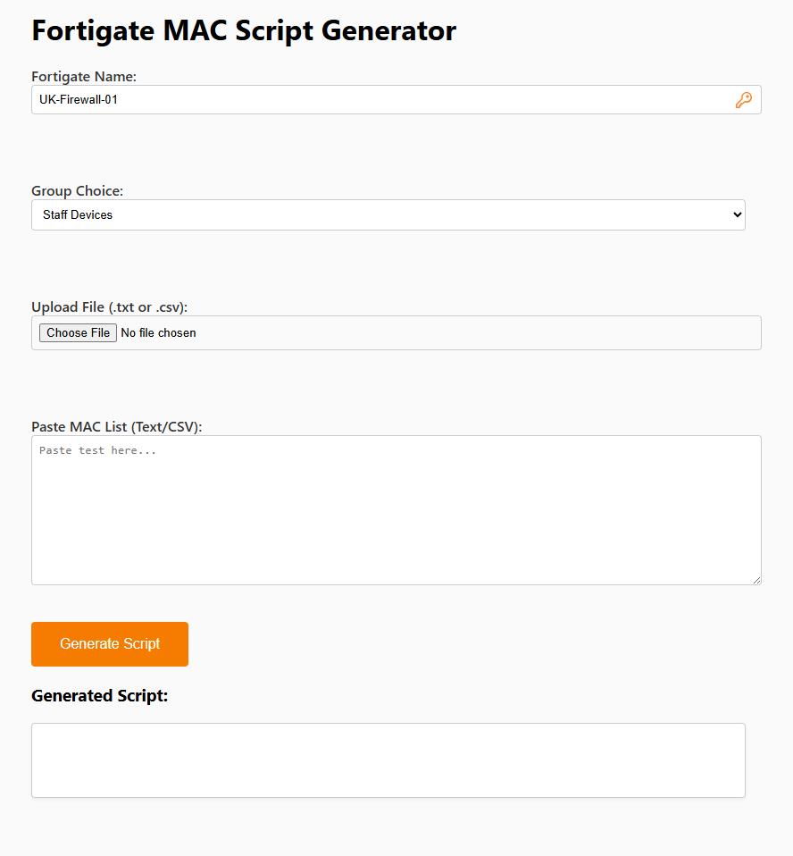
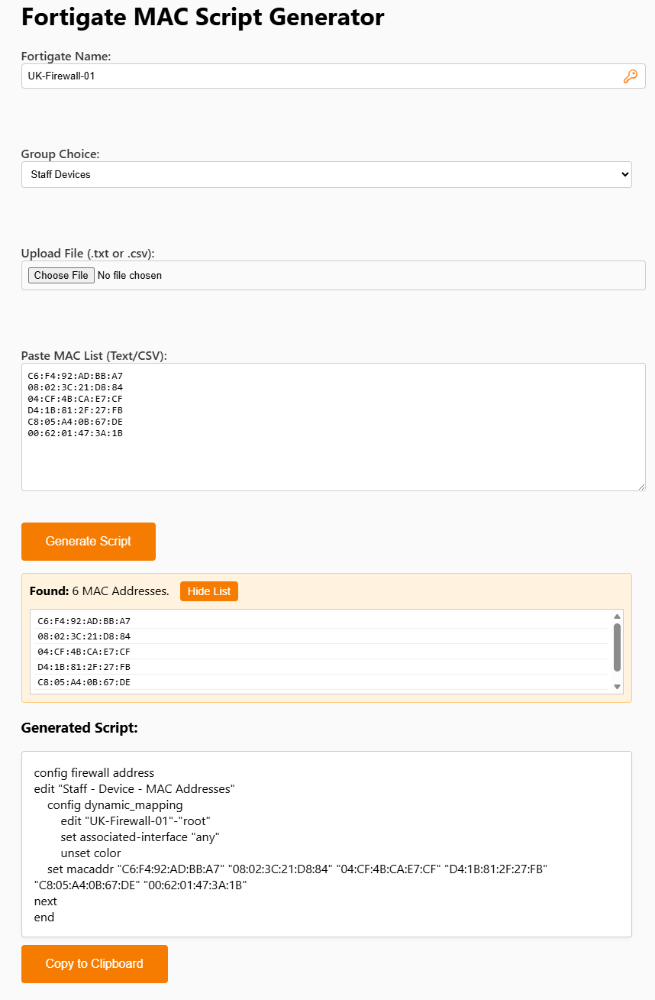

# Serverless Fortigate MAC Address Converter

A cloud-native microservice built on **Azure Serverless** architecture. This tool automates the creation of Fortigate Firewall configuration scripts, converting raw CSV data into formatted CLI commands.

## 🔒 Security & Access

**Note:** The live deployment of this application is currently secured behind **Azure Network Access Restrictions**.

- Public internet access is blocked.
- Access is whitelisted strictly to corporate/office static IP addresses.
- **CORS** policies are restricted to the specific frontend origin.

## 📸 Screenshots

### 1. Configuration Interface



### 2. Generated Script Output



## 🏗 Architecture

- **Frontend:** Azure Blob Storage Static Website (HTML/CSS/JS)
- **Backend:** Azure Functions (C# .NET 8 Isolated Worker)
- **Security:** CORS policies, IP Access Restrictions (Layer 4 Firewall), Usage Analysis.
- **Monitoring:** Azure Monitor Budget & Traffic Alerts.

## 🚀 Key Features

- **Serverless Compute:** backend logic runs on-demand via HTTP Triggers (Consumption Plan).
- **Security-First:** Implemented least-privilege CORS and IP whitelisting for internal tools.
- **Cost Optimized:** Runs entirely on Azure Free/Shared tiers with blob storage static hosting.

## 💻 Tech Stack

- **Language:** C#, JavaScript (Vanilla)
- **Cloud:** Microsoft Azure (AZ-204 Standards)
- **Tools:** Visual Studio 2026

## 🔧 How to Run Locally

1. Clone the repo.
2. Open `FortigateConverter.sln` in Visual Studio.
3. Run the Function Project (Backend).
4. Run the Frontend Project (ASP.NET Core - local development server only).

**Note:** The FortigateFrontend ASP.NET Core project is used for local development convenience only. In production, the static files (`wwwroot` contents) are deployed to an Azure Blob Storage Static Website.

## 📊 Architecture Diagram

```mermaid
graph LR
    User[User / Browser] --HTTPS--> Frontend[Azure Web App<br/>Frontend]
    Frontend --REST API / JSON--> Backend[Azure Function<br/>Backend API]
    Backend --Logic--> Script[Generate Script]

    subgraph Azure_Cloud_Security[Azure Cloud Security]
    Frontend
    Backend
    end

    style Backend fill:#0078d4,stroke:#fff,stroke-width:2px,color:#fff
    style Frontend fill:#5c2d91,stroke:#fff,stroke-width:2px,color:#fff
